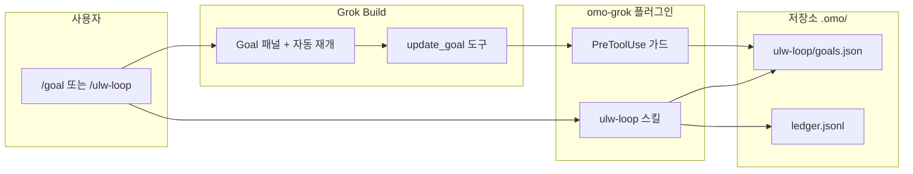

[English](./README.md) · [한국어](./README.ko.md)

# omo-grok — Grok Build용 oh-my-openagent Light

**omo-grok**는 [Grok Build](https://x.ai/cli) 터미널 코딩 에이전트에 **oh-my-openagent (omo) Light** 워크플로를 붙이는 플러그인입니다. 프로젝트 규칙, 코멘트 품질 검사, 그리고 Grok 네이티브 [`/goal`](https://x.ai/news/introducing-goal) 모드와 [lazycodex](https://github.com/code-yeongyu/lazycodex) 증거 시스템을 연결한 **장시간 작업 루프**를 제공합니다.

"대충 된 것 같다"가 아니라 **실제로 검증될 때까지** Grok이 큰 작업을 계속하게 하고 싶다면 이 플러그인이 목적에 맞습니다.

---

## 목차

- [이게 뭔가요?](#이게-뭔가요)
- [누구를 위한 건가요?](#누구를-위한-건가요)
- [사전 준비](#사전-준비)
- [빠른 시작](#빠른-시작)
- [포함 기능](#포함-기능)
- [장시간 작업: `/goal` × `ulw-loop`](#장시간-작업-goal--ulw-loop)
- [구성 요소가 어떻게 맞물리나요](#구성-요소가-어떻게-맞물리나요)
- [설치 및 업그레이드](#설치-및-업그레이드)
- [일상 사용 팁](#일상-사용-팁)
- [문제 해결](#문제-해결)
- [Repo Prompt](#repo-prompt)
- [개발 및 테스트](#개발-및-테스트)
- [omo-grok vs oh-my-grok](#omo-grok-vs-oh-my-grok)
- [링크](#링크)

---

## 이게 뭔가요?

Grok Build는 파일 수정, 명령 실행, 서브에이전트 호출은 잘 하지만, 기본적으로는 **짧은 대화 단위**로 동작합니다. **omo-grok**은 다음을 추가합니다.

1. **프로젝트 규칙** — Grok이 항상 볼 수 있게 (`AGENTS.md` 경유)
2. **comment-checker** — 코드에 들어가기 전 품질 낮은 AI 코멘트 차단
3. **`/ulw-loop`** — 작업을 `.omo/ulw-loop/` 아래 **지속 가능한 다단계 플랜**으로 만드는 슬래시 커맨드
4. **Grok `/goal` 연동** — 진행 패널과 자동 재개 루프
5. **lazycodex 증거 게이트** — 관찰 가능한 증거 없이는 "완료" 처리 불가

한 줄로: **Grok `/goal`이 UI·지속성·자동 재개를, ulw-loop가 엄격한 "증명해라" 체크리스트를 담당합니다.**

---

## 누구를 위한 건가요?

| 원하는 것 | omo-grok이 하는 일 |
|-----------|-------------------|
| 팀/프로젝트 규칙을 Grok이 자동으로 따르게 | `.omo/rules/**` → `AGENTS.md` 주입 |
| PR에 쓸데없는 AI 코멘트 줄이기 | 편집 시 품질 낮은 코멘트 `PreToolUse` 거부 |
| 몇 시간짜리 리팩터 + 보이는 체크리스트 | `/goal` + `/ulw-loop` + `.omo/ulw-loop/` |
| "완료" = 검증됨 | lazycodex 기준 + `.omo/ulw-loop/` 원장 |
| TUI 없이 스크립트 자동 재개 | `omo-grok-hook orchestrate --ultrawork` |

---

## 사전 준비

- **Grok Build CLI** — [x.ai/cli](https://x.ai/cli)에서 설치 (**0.2.82+** 검증)
- **Node.js 20+**, **npm**
- 이 저장소 **git clone** (일반 경로: `~/omo-grok`)
- 세션 도구에 **`update_goal`** 포함 (`/goal` 사용에 필요)

---

## 빠른 시작

### 1. 클론 후 플러그인 설치

```bash
git clone https://github.com/heomin86/omo-grok.git ~/omo-grok
cd ~/omo-grok
npm install
npm run build
npm run install-plugin
```

작업할 프로젝트에서 **새 Grok 세션**을 엽니다 (또는 TUI에서 `Ctrl+L`로 훅 재로드).

### 2. 플러그인 로드 확인

```bash
grok plugin list          # omo-grok 표시되어야 함
grok inspect --json       # ulw-loop 스킬, userInvocable: true 확인
```

### 3. 장시간 작업 실행 (권장)

Grok Build 안에서, 수정할 프로젝트 디렉터리에서:

```
/goal Use the ulw-loop skill to add input validation to the signup form
```

Grok이 **goal 모드**(진행 패널)를 켜고, **ulw-loop** 스킬을 로드한 뒤 `.omo/ulw-loop/` 플랜을 만들고 기준을 통과할 때까지 스토리 단위로 작업합니다.

### 대안: `/ulw-loop`로 시작

```
/ulw-loop add input validation to the signup form
```

에이전트가 플랜을 만든 뒤, 아래와 비슷한 한 줄을 출력합니다:

```
/goal Complete the durable ulw-loop plan in .omo/ulw-loop/goals.json, ...
```

**그 줄을 직접 실행**하세요 — `/goal`은 사용자만 호출할 수 있고 에이전트는 불가능합니다. 실행 후 goal 패널이 같은 작업에 붙습니다.

---

## 포함 기능

| 구성 요소 | 쉬운 설명 |
|-----------|----------|
| **rules** | `.omo/rules/**`를 읽어 워크스페이스 `AGENTS.md` 관리 블록에 씁니다. `OMO_RULES_AGENTS_MD=0`으로 끌 수 있습니다. |
| **comment-checker** | `PreToolUse`에서 품질 낮은 AI 코멘트가 포함된 편집을 거부합니다. |
| **update_goal guard** | ulw-loop 플랜 진행 중 **최종** 스토리 품질 게이트 전에는 `update_goal({completed: true})`를 막습니다. |
| **`/ulw-loop` 스킬** | `.omo/ulw-loop/` 플랜·원장·증거 워크플로 ([lazycodex](https://github.com/code-yeongyu/lazycodex)). |
| **ultrawork** | 전체 플랜 없이 단순 "계속해" 루프용 경량 상태. |
| **start-work-continuation** | `.omo/boulder.json` Prometheus/boulder 플랜 재개. |
| **LSP / hashline / ast-grep** | `skills/` 아래 선택적 헬퍼 스킬. |

설치 후 CLI:

- `omo-grok-hook` — Grok 훅 디스패처 + 헤드리스 오케스트레이터
- `omo-grok-ulw-loop` — lazycodex 상태 머신 (`create-goals`, `record-evidence`, `checkpoint`, …)

---

## 장시간 작업: `/goal` × `ulw-loop`

### 해결하는 문제

작은 수정은 짧은 대화로 충분합니다. 큰 작업에는 다음이 필요합니다.

- **보이는 체크리스트** (Grok `/goal` 패널)
- **턴을 넘기는 기억** (`.omo/ulw-loop/goals.json`, `ledger.jsonl`)
- **"완료" 전 증명** (lazycodex 성공 기준 + 증거)

omo-grok이 이 셋을 연결합니다.

### 두 가지 시작 방법

| 경로 | 입력 | 결과 |
|------|------|------|
| **A — 권장** | `/goal Use the ulw-loop skill to <작업>` | goal 모드 + ulw-loop 한 번에 |
| **B — ulw-loop 먼저** | `/ulw-loop <작업>` | 플랜 생성 후 `/goal …` 줄을 **사용자**가 실행 |

### 경로 B에 `/goal` 한 단계가 더 있는 이유

`/goal`은 **TUI 슬래시 커맨드**입니다. 플러그인·에이전트는 슬래시 커맨드를 실행할 수 없고, goal이 **이미 켜진 뒤**에만 `update_goal` **도구**를 씁니다. 플러그인은 정확한 한 줄을 **출력**하고, **사용자**가 한 번 붙여 넣어 패널을 켭니다.

### 동작하지 *않는* 경우 (흔한 실수)

채팅에 일반 텍스트만 입력:

```
ulw-loop fix the auth module
```

훅이 `.omo/ulw-loop/` 파일은 쓸 수 있지만, Grok은 **0.2.82 기준** `UserPromptSubmit`·`Stop` 훅 stdout을 **무시**합니다. 모델에 지시가 전달되지 않고 자동 재개도 없습니다. **`/ulw-loop`** 또는 **`/goal`**을 쓰세요.

### 헤드리스 / 스크립트 모드 (goal 패널 없음)

스크립트·CI·tmux 자동화:

```bash
omo-grok-hook orchestrate --ultrawork --task "<작업>" \
  [--cwd DIR] [--model grok-build] [--max-iterations N]
```

`<promise>VERIFIED</promise>` 등 완료 신호가 나올 때까지 `grok -p` 루프를 돕니다.

---

## 구성 요소가 어떻게 맞물리나요



- **Grok `/goal`** — UI, 지속성, 재프롬프트 루프
- **ulw-loop** — 플랜, 기준, 증거, 품질 게이트
- **가드** — 최종 게이트 전 `update_goal({completed:true})` 거부

---

## 설치 및 업그레이드

### 최초 설치

```bash
cd ~/omo-grok
npm install
npm run build
npm run install-plugin
```

**새 Grok 세션** 또는 TUI **`Ctrl+L`**.

### 업그레이드

```bash
cd ~/omo-grok
git pull
npm install
npm run build
npm run install-plugin
```

변경 이력: [CHANGELOG.md](./CHANGELOG.md), [Releases](https://github.com/heomin86/omo-grok/releases).

---

## 일상 사용 팁

- **상태 확인:** `omo-grok-ulw-loop status --goal-runtime grok --json`
- **Goal 스냅샷:** Grok 세션 디렉터리의 `goal/plan.md`, 또는 `omo-grok-ulw-loop grok-goal-snapshot read --session-id <id>`
- **경량 ultrawork 취소:** `/cancel-ulw` 또는 "cancel ultrawork"
- **ulw-loop 한 사이클 끝난 뒤:** 다른 작업 전 `/goal clear`
- **프로젝트 규칙:** `.omo/rules/` 아래 마크다운 추가 → 세션 시작 시 `AGENTS.md` 동기화

---

## 문제 해결

| 증상 | 원인 | 해결 |
|------|------|------|
| 슬래시 메뉴에 `/ulw-loop` 없음 | 플러그인 미설치/비활성 | `npm run install-plugin`, 새 세션, `grok plugin list` |
| `/goal` 없음 | goal 기능 꺼짐 또는 `update_goal` 미포함 | Grok CLI 업데이트, 세션 도구 확인 |
| `.omo` 파일만 생기고 에이전트 멈춤 | 일반 텍스트 `ulw-loop` 사용 | `/ulw-loop` 또는 `/goal Use the ulw-loop skill to …` |
| "/goal 실행하라"는데 패널 안 뜸 | 에이전트는 슬래시 실행 불가 | 출력된 `/goal …` 줄을 **직접** 실행 |
| 중간에 `update_goal` 거부 | 조기 완료 가드 | 최종 스토리+품질 게이트 전까지 정상; 기준 계속 진행 |
| dev tree에서 `grok plugin install` 실패 | Grok 레지스트리 이슈 | `npm run install-plugin` (스테이징 우회) |

---

## Repo Prompt

[Repo Prompt](https://repoprompt.com) / [RepoPrompt CE](https://github.com/repoprompt/repoprompt-ce)는 macOS용 **컨텍스트 엔지니어링** 앱입니다. 파일 선택, CodeMap, 메타 프롬프트를 모아 AI 에이전트에 넘기기 좋게 정리합니다.

이 저장소는 [`.repoprompt/`](./.repoprompt/) 아래 **프로젝트 번들**을 포함합니다. Repo Prompt에 **omo-grok** 워크스페이스로 추가할 때 매번 파일을 찾지 않아도 됩니다.

| 파일 | Repo Prompt에서 쓰는 방법 |
| --- | --- |
| [`.repoprompt/meta-prompt.md`](./.repoprompt/meta-prompt.md) | Compose → **Meta prompt** (아키텍처·편집 규칙) |
| [`.repoprompt/default-selection.txt`](./.repoprompt/default-selection.txt) | **파일 선택**에 아래 경로들 추가 |
| [`.repoprompt/user-instructions.md`](./.repoprompt/user-instructions.md) | Compose → **User instructions** 템플릿 |
| [`.repoprompt/project-profile.json`](./.repoprompt/project-profile.json) | 스크립트/도구용 메타데이터 |

### macOS 자동 등록

**Repo Prompt 앱이 실행 중**이어야 합니다. 저장소 루트에서:

```bash
bash scripts/register-repoprompt-workspace.sh
```

워크스페이스 이름 **`omo-grok`** 으로 이 폴더를 등록하고, 메타 프롬프트를 best-effort로 붙입니다. `REPOPROMPT_WORKSPACE_NAME=이름` 으로 변경 가능.

### 수동 등록 (UI)

1. **Repo Prompt CE** → **Manage Workspaces**
2. **Create a New Workspace** → **Add Folders** → `~/omo-grok` 선택
3. 이름: **`omo-grok`**
4. **Compose**에서 [`.repoprompt/meta-prompt.md`](./.repoprompt/meta-prompt.md) 붙여 넣고, [`.repoprompt/default-selection.txt`](./.repoprompt/default-selection.txt) 경로들을 선택

자세한 내용: [`.repoprompt/README.md`](./.repoprompt/README.md)

---

## 개발 및 테스트

```bash
npm run build
npm test
npm run verify-gates

export GROK_PLUGIN_ROOT="$(pwd)"
printf '%s\n' '{"hookEventName":"UserPromptSubmit","sessionId":"s1","workspaceRoot":"'"$(pwd)"'","prompt":"/ulw-loop fix tests"}' \
  | bash hooks/run-hook.sh user-prompt
```

---

## omo-grok vs oh-my-grok

| | **omo-grok** (이 저장소) | **oh-my-grok** |
|--|--------------------------|----------------|
| 초점 | omo 경로 (`.omo/`), comment-checker, lazycodex ulw-loop | skill-gate, hashline, prometheus, superpowers 번들 |
| 적합 | lazycodex 증거 루프 + Grok `/goal` | 더 넓은 Grok 스킬 생태계 |

둘 다 설치 가능; Stop 훅 중복을 피하려 **루프 플러그인은 하나**만 primary로 켜세요.

---

## 링크

- 저장소: https://github.com/heomin86/omo-grok
- lazycodex: https://github.com/code-yeongyu/lazycodex
- Grok `/goal` 소개: https://x.ai/news/introducing-goal
- 최신 릴리즈: https://github.com/heomin86/omo-grok/releases/latest
- 변경 이력: [CHANGELOG.md](./CHANGELOG.md)
- English README: [README.md](./README.md)
- Repo Prompt 번들: [`.repoprompt/`](./.repoprompt/)

**라이선스:** SUL-1.0 (저장소 참조)
