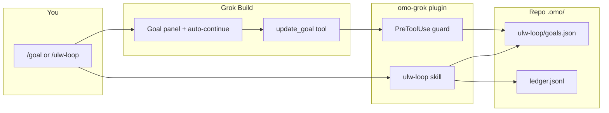

[English](./README.md) · [한국어](./README.ko.md)

# omo-grok — oh-my-openagent Light for Grok Build

**omo-grok** is a [Grok Build](https://x.ai/cli) plugin that brings the **oh-my-openagent (omo) Light** workflow into your terminal coding agent. It adds durable project rules, comment quality checks, and a long-running task loop that pairs Grok's native [`/goal`](https://x.ai/news/introducing-goal) mode with the [lazycodex](https://github.com/code-yeongyu/lazycodex) evidence system.

If you want Grok to keep working on a large task until it is **actually verified** — not just "looks done" — this plugin is for you.

---

## Table of contents

- [What is this?](#what-is-this)
- [Who is it for?](#who-is-it-for)
- [Prerequisites](#prerequisites)
- [Quick start](#quick-start)
- [What's included](#whats-included)
- [Long-running tasks: `/goal` × `ulw-loop`](#long-running-tasks-goal--ulw-loop)
- [How the pieces fit together](#how-the-pieces-fit-together)
- [Install & upgrade](#install--upgrade)
- [Daily usage tips](#daily-usage-tips)
- [Troubleshooting](#troubleshooting)
- [Repo Prompt](#repo-prompt)
- [Develop & test](#develop--test)
- [omo-grok vs oh-my-grok](#omo-grok-vs-oh-my-grok)
- [Links](#links)

---

## What is this?

Grok Build can edit files, run commands, and spawn subagents — but by default each turn is a short conversation. **omo-grok** adds:

1. **Project rules** that Grok always sees (via `AGENTS.md`)
2. **Comment checker** that blocks low-quality AI comments before they land in your code
3. **`/ulw-loop`** — a slash command that turns a task into a **durable multi-step plan** stored under `.omo/ulw-loop/`
4. **Integration with Grok `/goal`** — the live progress panel and auto-continue loop from Grok Build
5. **Evidence gates** from lazycodex — work is not "done" until observable proof is recorded

Think of it as: **Grok `/goal` handles persistence and the UI panel; ulw-loop handles the rigorous "prove it" checklist.**

---

## Who is it for?

| You want… | omo-grok helps by… |
|-----------|-------------------|
| Grok to follow team/project rules automatically | Injecting `.omo/rules/**` into `AGENTS.md` |
| Fewer useless AI comments in PRs | Blocking slop comments on edit (`PreToolUse`) |
| Multi-hour refactors with a visible checklist | `/goal` + `/ulw-loop` + `.omo/ulw-loop/` state |
| "Done" to mean verified, not guessed | lazycodex criteria + ledger under `.omo/ulw-loop/` |
| Scripted CI-style auto-continue (no TUI) | `omo-grok-hook orchestrate --ultrawork` |

---

## Prerequisites

- **Grok Build CLI** — install from [x.ai/cli](https://x.ai/cli) (tested on **0.2.82+**)
- **Node.js 20+** and **npm**
- **git** clone of this repo (typical path: `~/omo-grok`)
- A Grok account with **`update_goal`** available in your session (required for `/goal`)

---

## Quick start

### 1. Clone and install the plugin

```bash
git clone https://github.com/heomin86/omo-grok.git ~/omo-grok
cd ~/omo-grok
npm install
npm run build
npm run install-plugin
```

Start a **new Grok session** in your project (or press `Ctrl+L` in the TUI to reload hooks).

### 2. Verify the plugin loaded

```bash
grok plugin list          # should list omo-grok
grok inspect --json       # should show ulw-loop skill, userInvocable: true
```

### 3. Run a long task (recommended)

Inside Grok Build, in the project you want to change:

```
/goal Use the ulw-loop skill to add input validation to the signup form
```

Grok turns on **goal mode** (progress panel), loads the **ulw-loop** skill, creates a plan under `.omo/ulw-loop/`, and works story-by-story until criteria pass.

### Alternative: start with `/ulw-loop`

```
/ulw-loop add input validation to the signup form
```

The agent bootstraps the plan, then prints a line like:

```
/goal Complete the durable ulw-loop plan in .omo/ulw-loop/goals.json, ...
```

**Copy and run that line yourself** — only the user can invoke `/goal`; the agent cannot. After that, the goal panel attaches to the same run.

---

## What's included

| Component | What it does (plain language) |
|-----------|------------------------------|
| **rules** | Reads `.omo/rules/**` and writes a managed block into your workspace `AGENTS.md` so Grok always sees your project conventions. Disable with `OMO_RULES_AGENTS_MD=0`. |
| **comment-checker** | On `PreToolUse`, denies edits that add "AI slop" comments (`search_replace`, `write_file`, etc.). |
| **update_goal guard** | While an ulw-loop plan is active, blocks `update_goal({completed: true})` until the **final** story passes the quality gate — so Grok cannot mark the goal complete too early. |
| **`/ulw-loop` skill** | Slash command + skill that creates `.omo/ulw-loop/` plans, ledger, and evidence workflow ([lazycodex](https://github.com/code-yeongyu/lazycodex)). |
| **ultrawork** | Lightweight loop state for simple "keep going" tasks when no full plan exists yet. |
| **start-work-continuation** | Resumes Prometheus/boulder plans from `.omo/boulder.json` via Stop-hook logic (headless orchestrator uses the same contract). |
| **LSP / hashline / ast-grep skills** | Optional helpers bundled as skills (see `skills/`). |

CLI binaries after install:

- `omo-grok-hook` — Grok lifecycle hook dispatcher + headless orchestrator
- `omo-grok-ulw-loop` — lazycodex ulw-loop state machine (`create-goals`, `record-evidence`, `checkpoint`, …)

---

## Long-running tasks: `/goal` × `ulw-loop`

### The problem

Short chat turns are fine for small fixes. Large tasks need:

- A **visible checklist** (Grok `/goal` panel)
- **Memory across turns** (`.omo/ulw-loop/goals.json`, `ledger.jsonl`)
- **Proof before "done"** (lazycodex success criteria + evidence)

omo-grok connects all three.

### Two entry paths

| Path | You type | What happens |
|------|----------|--------------|
| **A — recommended** | `/goal Use the ulw-loop skill to <task>` | Goal mode + ulw-loop skill in one step |
| **B — ulw-loop first** | `/ulw-loop <task>` | Plan is created; agent prints `/goal …` for **you** to run |

### Why path B needs an extra `/goal` step

`/goal` is a **TUI slash command**. Plugins and agents **cannot** run slash commands — they only get the `update_goal` **tool**, and only while a goal is already active. So the plugin prints the exact line; **you** paste it once to start the panel.

### What does *not* work (common mistake)

Typing plain text in chat:

```
ulw-loop fix the auth module
```

Hooks may write files under `.omo/ulw-loop/`, but Grok **ignores** `UserPromptSubmit` and `Stop` hook stdout (verified on **0.2.82**). No steering reaches the model, and nothing auto-continues. Use **`/ulw-loop`** or **`/goal`** instead.

### Headless / scripted mode (no goal panel)

For scripts, CI, or tmux automation:

```bash
omo-grok-hook orchestrate --ultrawork --task "<task>" \
  [--cwd DIR] [--model grok-build] [--max-iterations N]
```

This loops `grok -p` with the same continuation rules until the task reports completion (e.g. `<promise>VERIFIED</promise>`).

---

## How the pieces fit together



- **Grok `/goal`** — UI, persistence, re-prompt loop
- **ulw-loop** — plan, criteria, evidence, quality gate
- **Guard** — `update_goal({completed:true})` denied until final gate passes

---

## Install & upgrade

### First-time install

```bash
cd ~/omo-grok
npm install
npm run build
npm run install-plugin   # runs grok plugin install --trust with staging workaround
```

Reload: **new Grok session** or TUI **`Ctrl+L`**.

### Upgrade

```bash
cd ~/omo-grok
git pull
npm install
npm run build
npm run install-plugin
```

See [CHANGELOG.md](./CHANGELOG.md) and [Releases](https://github.com/heomin86/omo-grok/releases).

---

## Daily usage tips

- **Inspect state:** `omo-grok-ulw-loop status --goal-runtime grok --json`
- **Goal snapshot:** read `goal/plan.md` in the Grok session dir, or `omo-grok-ulw-loop grok-goal-snapshot read --session-id <id>`
- **Cancel lightweight ultrawork:** `/cancel-ulw` or say "cancel ultrawork"
- **After a full ulw-loop run:** ask Grok to clear with `/goal clear` before starting unrelated work
- **Project rules:** add markdown under `.omo/rules/`; they sync into `AGENTS.md` on session start

---

## Troubleshooting

| Symptom | Likely cause | Fix |
|---------|--------------|-----|
| No `/ulw-loop` in slash menu | Plugin not installed or disabled | `npm run install-plugin`, new session, `grok plugin list` |
| No `/goal` in menu | Goal feature off or no `update_goal` in toolset | Update Grok CLI; check session tools |
| Plan files appear but agent stops | Used plain-text `ulw-loop`, not slash command | Use `/ulw-loop` or `/goal Use the ulw-loop skill to …` |
| Agent says "run /goal" but panel never shows | Agent cannot run slash commands | **You** must paste the printed `/goal …` line |
| `update_goal` denied mid-run | Guard blocking early completion | Expected until final story + quality gate; keep working criteria |
| `grok plugin install` fails from dev tree | Known Grok registry quirk | `install-plugin.sh` stages a clean copy — use `npm run install-plugin` |

---

## Repo Prompt

[Repo Prompt](https://repoprompt.com) / [RepoPrompt CE](https://github.com/repoprompt/repoprompt-ce) is a macOS app for curating repository context (file selection, CodeMaps, meta prompts) before sending work to an AI agent.

This repo ships a **project bundle** under [`.repoprompt/`](./.repoprompt/) so you can add **omo-grok** as a workspace without hunting for the right files each time.

| File | Use in Repo Prompt |
| --- | --- |
| [`.repoprompt/meta-prompt.md`](./.repoprompt/meta-prompt.md) | Compose → **Meta prompt** (architecture + editing rules) |
| [`.repoprompt/default-selection.txt`](./.repoprompt/default-selection.txt) | Add these paths to your **file selection** |
| [`.repoprompt/user-instructions.md`](./.repoprompt/user-instructions.md) | Compose → **User instructions** template |
| [`.repoprompt/project-profile.json`](./.repoprompt/project-profile.json) | Metadata for scripts / tooling |

### Register on macOS (automatic)

Repo Prompt must be **running**. From the repo root:

```bash
bash scripts/register-repoprompt-workspace.sh
```

This creates (or updates) a workspace named **`omo-grok`** pointing at this folder and best-effort loads the meta prompt. Override the name with `REPOPROMPT_WORKSPACE_NAME=my-name`.

### Register manually (UI)

1. Open **Repo Prompt CE** → **Manage Workspaces**
2. **Create a New Workspace** → **Add Folders** → select `~/omo-grok` (this clone)
3. Name it **`omo-grok`**
4. In **Compose**, paste [`.repoprompt/meta-prompt.md`](./.repoprompt/meta-prompt.md) and add files listed in [`.repoprompt/default-selection.txt`](./.repoprompt/default-selection.txt)

See [`.repoprompt/README.md`](./.repoprompt/README.md) for bundle details.

---

## Develop & test

```bash
npm run build
npm test                 # unit tests + verify-gates when plugin is installable
npm run verify-gates     # full gate script → $SCRATCH/verify-gates-stdout.log

# Manual hook probe
export GROK_PLUGIN_ROOT="$(pwd)"
printf '%s\n' '{"hookEventName":"UserPromptSubmit","sessionId":"s1","workspaceRoot":"'"$(pwd)"'","prompt":"/ulw-loop fix tests"}' \
  | bash hooks/run-hook.sh user-prompt
```

---

## omo-grok vs oh-my-grok

| | **omo-grok** (this repo) | **oh-my-grok** |
|--|--------------------------|----------------|
| Focus | Authentic omo paths (`.omo/`), comment-checker, lazycodex ulw-loop | skill-gate, hashline, prometheus, bundled superpowers |
| Best for | lazycodex evidence loop + `/goal` on Grok Build | Broader Grok skill ecosystem |

Both can be installed; enable **one** primary loop plugin to avoid duplicate Stop hooks.

---

## Links

- Repository: https://github.com/heomin86/omo-grok
- lazycodex: https://github.com/code-yeongyu/lazycodex
- Grok `/goal` announcement: https://x.ai/news/introducing-goal
- Latest release: https://github.com/heomin86/omo-grok/releases/latest
- Changelog: [CHANGELOG.md](./CHANGELOG.md)
- Korean README: [README.ko.md](./README.ko.md)
- Repo Prompt bundle: [`.repoprompt/`](./.repoprompt/)

**License:** SUL-1.0 (see repository)
